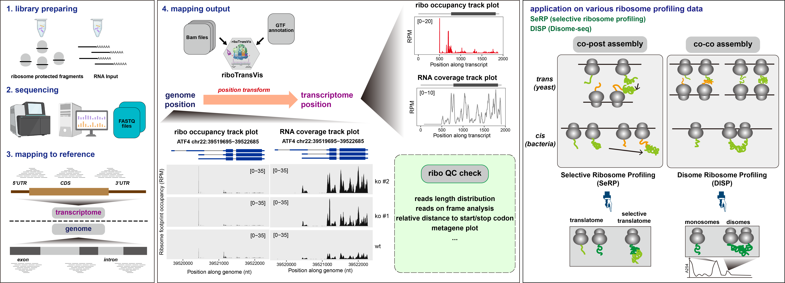

# riboTransVis


<!-- badges: start -->

**riboTransVis** is an R package specifically developed for analyzing and visualizing **Ribo-seq (ribosome profiling)** data, offering comprehensive features including **quality control metrics**, **RPF occupancy visualization**, and **metagene analysis**. The package supports both **transcriptome-aligned** and **genome-aligned** **BAM** files, expanding its utility across different ribosome profiling experimental designs. Its efficient data processing strategy selectively extracts alignment data from specific genomic regions using GTF annotations, rather than loading entire BAM files into memory, significantly improving computational efficiency for single-gene visualizations. The package includes essential functionalities such as read length distribution analysis, frame-specific ribosome density visualization, RPM normalization, and rolling window smoothing, while seamlessly integrating with ggplot2 for publication-quality visualizations. These features, combined with its optimized performance, make riboTransVis an invaluable tool for computational biologists and RNA researchers investigating mRNA translation dynamics.

<!-- badges: end -->

---

## Workflow



## Installation

You can install the development version of riboTransVis like so:

``` r
# install.packages("devtools")
devtools::install_github("junjunlab/riboTransVis")

# or
remotes::install_github("junjunlab/riboTransVis")
```

## Citation

> Jun Zhang (2025). *A Package for Ribosome Profiling Data Analysis.*  https://github.com/junjunlab/riboTransVis


